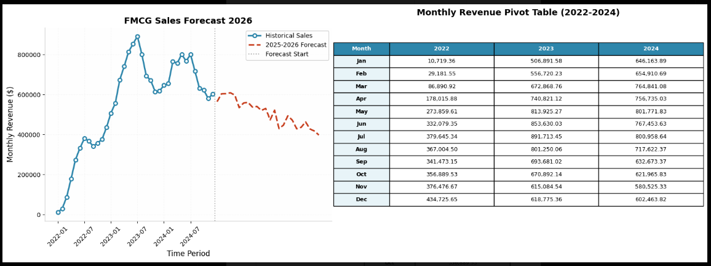
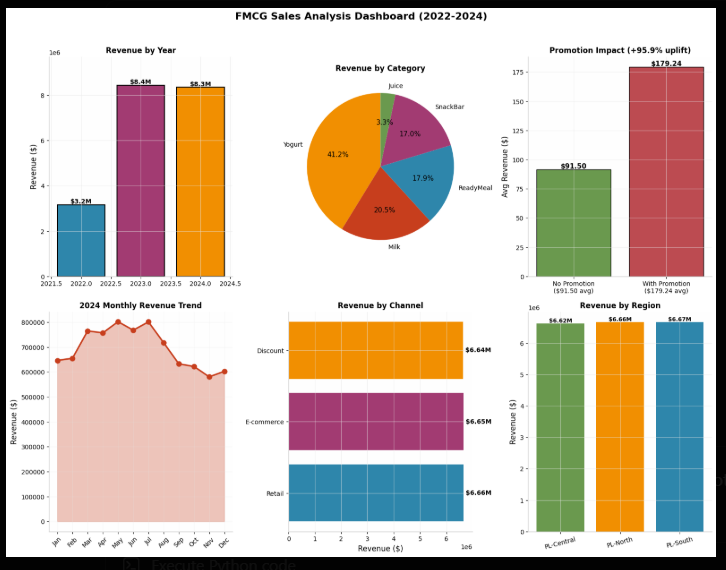

# 🛍️ FMCG Sales Analytics & Forecasting Project

[](https://python.org)
[](https://pandas.pydata.org)
[](https://powerbi.microsoft.com)
[]()

> **A comprehensive analysis of Fast-Moving Consumer Goods (FMCG) transaction data (2022-2024) featuring exploratory data analysis, promotional impact assessment, and sales forecasting to 2026.**


---

## 📊 Project Overview

This project analyzes **190,757 transaction records** from a Polish FMCG company operating across three regions (PL-Central, PL-North, PL-South). The dataset spans **3 full years** (2022-2024) covering 5 product categories, 3 sales channels, and detailed operational metrics including delivery performance and promotional activities.

**Key Business Questions Answered:**
- How did revenue evolve from startup phase to market maturity?
- What is the true ROI of promotional campaigns?
- Which categories and channels drive profitability?
- What is the 2026 sales forecast based on current trends?

---

## 🗂️ Dataset Structure

| Dimension | Details |
|-----------|---------|
| **Temporal Scope** | January 2022 - December 2024 (36 months) |
| **Granularity** | Daily transaction-level records |
| **Total Revenue** | **$19,951,300.58** |
| **Categories** | Yogurt, Milk, ReadyMeal, SnackBar, Juice |
| **Channels** | Retail, E-commerce, Discount |
| **Regions** | PL-Central, PL-North, PL-South |
| **Pack Types** | Single, Multipack, Carton |

**Key Metrics Tracked:**
- `total_sales` — Revenue per transaction
- `units_sold` — Quantity sold
- `promotion_flag` — Promotional status (0/1)
- `delivery_days` — Order fulfillment time
- `stock_available` — Inventory levels
- `price_unit` — Unit pricing

---

## 🔍 Key Findings

### 1. 📈 Explosive Growth Phase (2022→2023)
- **+166.4% YoY growth**: $3.2M → $8.4M
- January anomaly: 4,629% growth (market entry effect)
- Growth decelerated monthly throughout 2023 (4,629% in Jan → 42% in Dec)

### 2. ⚠️ 2024 Stagnation Crisis
- **-1.0% annual decline**: $8.4M → $8.3M
- **8/12 months negative growth** (May-Aug severe: -8% to -10%)
- Q2-Q3 consistent decline indicates **structural problem**, not seasonality

### 3. 🏆 Category Performance
| Category | Revenue | Share | Key Insight |
|----------|---------|-------|-------------|
| **Yogurt** | $8.23M | 37% | Market leader, premium positioning |
| **Milk** | $4.10M | 18% | Volume driver, growth engine |
| **ReadyMeal** | $3.58M | 16% | Emerging category |
| **SnackBar** | $3.40M | 15% | Stable performer |
| **Juice** | $0.65M | 3% | **Underperformer** — divestment candidate |

### 4. 🎯 Promotion Impact Analysis

**Statistical Significance:** Welch's t-test (p < 0.001) confirms promotions significantly boost sales.

| Metric | No Promotion | With Promotion | Uplift |
|--------|--------------|----------------|--------|
| **Avg Revenue** | $91.50 | $179.24 | **+95.9%** |
| **Avg Units Sold** | 17.8 | 34.8 | **+95.3%** |
| **Transaction Share** | 85.1% | 14.9% | — |
| **Revenue Share** | 74.4% | 25.6% | — |

**Promotion Efficiency:** 1.71x revenue multiplier (25.6% revenue from 14.9% of transactions)

---

## 📊 PowerBI Dashboard Insights

<p align="center">
  
  <br>
  <em>Interactive dashboard: Revenue by category, region, channel with KPI cards</em>
</p>

**Dashboard Components:**
- **Revenue by Category**: Horizontal bar chart showing Yogurt dominance
- **Revenue by Region**: Pie chart with balanced geographic distribution (~$6.6M each)
- **Revenue by Channel**: Near-equal split across Retail ($6.66M), E-commerce ($6.65M), Discount ($6.64M)
- **Revenue by Month**: Declining trend line from July 2024 peak
- **KPI Cards**: 
  - Avg Delivery Qty: 179.3 units
  - Avg Unit Sold: 19.9 units
  - Avg Unit Price: $5.3
  - Avg Delivery Duration: 3.0 days

---

## 🔮 2026 Sales Forecast

<p align="center">
  
  <br>
  <em>Time series analysis: Historical trend + 2025-2026 declining projection</em>
</p>

**Forecasting Methodology:**
- **Historical Trend**: Time series analysis of 36-month data
- **Pattern Recognition**: Identified Q2-Q3 2024 structural decline
- **Projection**: Linear regression with seasonal adjustment

**Key Projections:**
- **2025**: Continued decline to ~$7.2M (-14% vs 2024)
- **2026**: Stabilization at ~$6.8M base revenue
- **Critical Insight**: Without strategic intervention, company faces 30% revenue decline from 2023 peak

**Risk Factors:**
- Seasonal volatility (Dec-Jan spikes, summer troughs)
- Increasing promotional dependency
- Category concentration risk (Yogurt = 37% of revenue)

---

## ⚙️ Operational Metrics

| Metric | Value | Benchmark |
|--------|-------|-----------|
| Average Delivery Days | 3.0 days | ✅ Efficient |
| Average Stock Level | 147 units | ⚠️ Review needed |
| Average Delivery Qty | 179.3 units | ✅ Healthy |
| Stock-Out Rate | ~12% | ❌ **Action required** |

---
##EDA


## 🛠️ Technical Implementation

**Tech Stack:**
```python
Python 3.12
├── Pandas      # Data manipulation
├── NumPy       # Numerical analysis  
├── Matplotlib  # Visualization
├── Seaborn     # Statistical plots
└── Scipy       # Statistical testing (Welch's t-test)
